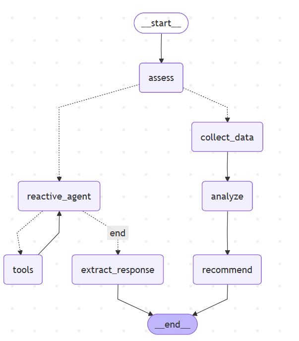

# 混合式智能投研顾问 Agent（Hybrid Wealth Advisor Agent）

本项目基于 LangGraph+Streamlit+FastAPI构建，设计了一个结合快速响应（Reactive）与深度分析（Deliberative）的智能投研顾问系统。该系统能够根据用户问题的复杂程度，自动选择不同的处理路径，实现兼顾响应速度与分析能力的智能决策。项目同时通过FastAPI将Agent封装为标准HTTP接口，使其具备服务化能力。

## 一、项目架构
```
Agent-Project/
├── src/
│ ├── hybrid_wealth_advisor_langgraph.py # 核心工作流
│ ├── streamlit_app.py # 前端界面
│ └── api.py # 后端服务
├── assets/
│ └── workflow.png # 系统流程图
├── requirements.txt
├── README.md
└── .gitignore
```

## 二、运行方式

1. 安装依赖
   pip install -r requirements.txt
2. 启动 API 服务
   uvicorn src.api:app --reload --host 0.0.0.0 --port 8000
   启动后访问：
   http://127.0.0.1:8000/docs
3. 启动前端（可选）
   streamlit run src/streamlit_app.py

## 三、API使用示例

1. 健康检查
   curl http://127.0.0.1:8000/health
2. 聊天接口示例
   curl -X POST "http://127.0.0.1:8000/chat" \
   -H "Content-Type: application/json" \
   -d "{\"query\":\"今天上证指数怎么样？\",\"customer_id\":\"customer1\"}"

## 四、技术选型

本项目选择Python作为实现语言，主要因为其在大模型应用开发、生态成熟。在Agent编排部分，我使用了LangGraph，因为它比简单的单轮调用更适合表达多步骤、有分支的执行流程。在服务层，我使用FastAPI对Agent能力进行封装，使其不仅能通过Streamlit页面交互，也能作为标准HTTP API被外部系统调用。

## 五、核心实现

本项目的核心难点在于如何让系统根据问题复杂度自动选择处理路径。为了解决这个问题，我设计了一个Hybrid Agent架构：先由assess节点判断问题类型和处理模式；如果是简单问题，则进入reactive_agent，通过工具调用快速返回结果；如果是复杂问题，则进入collect_data、analyze、recommend的深度分析链路。这种方式兼顾了响应速度和分析质量，也比单一链路更接近真实业务中的场景。系统架构图如下：


## 六、示例问题

### 简单问题（走 Reactive）

- 今天上证指数怎么样？
- 我的股票占比是多少？
- 什么是ETF？

### 复杂问题（走 Deliberative）

- 当前市场下我该如何优化投资组合？
- 请帮我做一个10年的教育金投资计划
- 如何在经济衰退中进行资产配置？

### 示例客户画像
```
SAMPLE_CUSTOMER_PROFILES = { \
    "customer1": { \
        "customer_id": "C10012345",\
        "risk_tolerance": "平衡型",\
        "investment_horizon": "中期",\
        "financial_goals": ["退休规划", "子女教育金"],\
        "investment_preferences": ["ESG投资", "科技行业"],\
        "portfolio_value": 1500000.0,\
        "current_allocations": {\
            "股票": 0.40,\
            "债券": 0.30,\
            "现金": 0.10,\
            "另类投资": 0.20\
        }\
    },\
    "customer2": {\
        "customer_id": "C10067890",\
        "risk_tolerance": "进取型",\
        "investment_horizon": "长期",\
        "financial_goals": ["财富增长", "资产配置多元化"],\
        "investment_preferences": ["新兴市场", "高成长行业"],\
        "portfolio_value": 3000000.0,\
        "current_allocations": {\
            "股票": 0.65,\
            "债券": 0.15,\
            "现金": 0.05,\
            "另类投资": 0.15\
        }\
    }\
}\
```

## 七. 权衡与展望

当前项目中的市场数据、组合数据和新闻数据仍然是模拟数据，主要用于展示 Agent 的整体工作流和服务封装能力。  
如果未来需要支撑更大规模用户，我会从几个方向扩展：第一，引入真实行情和资讯API；第二，增加RAG知识库，例如elasticsearch来解决处理大量文档数据时的速度问题；第三，增加缓存机制，从而控制token的消耗；第四，引入日志监控，实时查询日志的信息情况来对过程中出现的问题进行处理。
